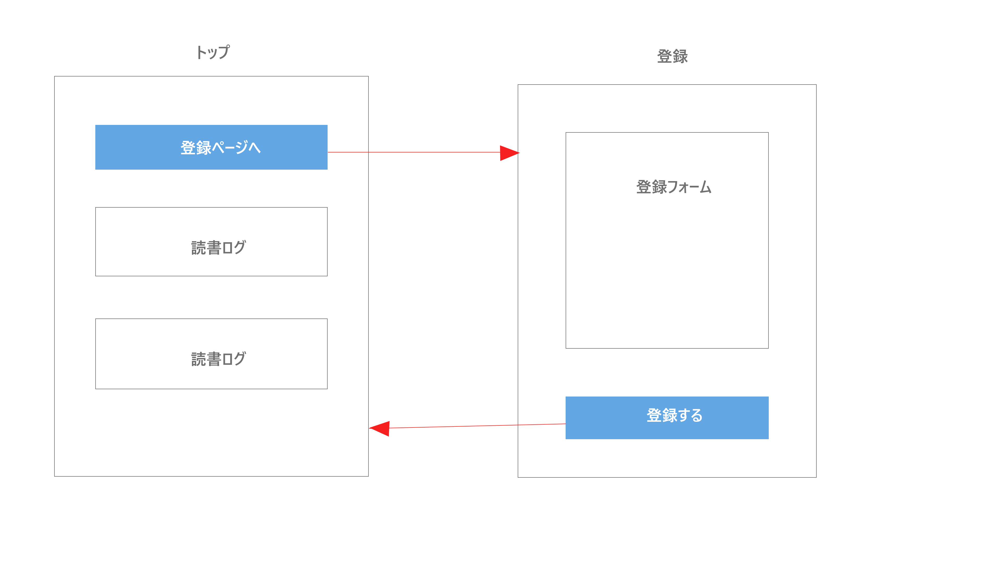
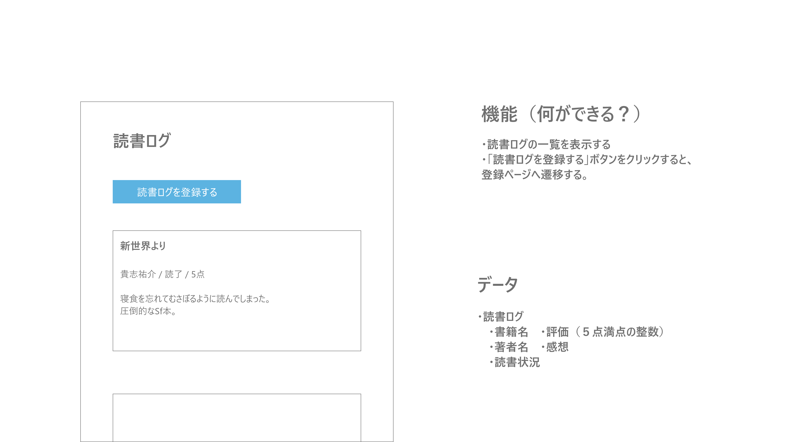
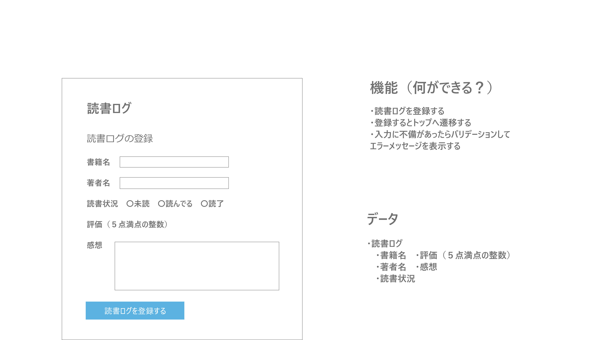

システムを作る上で、「必要な条件」を定義してシステムに落としこめるようにしよう。
- 業務要件
  - 業務フロー
- 機能要件
  - ページ遷移図
  - WF(画面図)
  - 機能
  - データ
- 非機能要件
  - 性能
  - 拡張性
  - 可用性
  - セキュリティ
- 運用・保守要件
  - 運用体制
  - 保守体制
  - 障害時体制

## 業務要件(業務フロー)
登場人物ごとに業務(行動)の流れを図にしよう

人物 --- 業務フロー

自分 --- サイトを開く --> 読書ログを登録する --> 読書ログを閲覧する

自分 --- サイトを開く --> 読書ログを閲覧する

## 機能要件(ページ遷移図)
必要なページを洗い出して、ページの流れを図にしよう

## 機能要件(WF・機能・データ)
ワイヤーフレーム、機能、データをページごとにまとめよう
### 「トップページ」

### 「登録ページ」

